## 【flutter】从零开始的五星红旗

> 中华人民共和国国旗是五星红旗。  
> 中华人民共和国国旗是中华人民共和国的象征和标志。每个公民和组织，都应当尊重和爱护国旗。  
> ——  中华人民共和国国旗法


恰逢国庆，举国同庆，今天当一次科普星，我们用 `flutter` 的 [CustomPaint](https://api.flutter-io.cn/flutter/widgets/CustomPaint-class.html) 来绘制一个标准的五星红旗


### 五星红旗的由来

        中华人民共和国国旗，即五星红旗，是中华人民共和国的国家象征之一；左上角镶有五颗黄色五角星的红色旗帜，旗帜图案中的四颗小星环绕在一颗大星右侧呈半环形，大五角星象征着中国共产党，四颗小五角星象征着工人阶级、农民阶级、城市小资产阶级和民族资产阶级，五颗星的排列图形象征中国领土海棠的形状。
        五星红旗的设计者是来自浙江瑞安的普通公民曾联松。随着中国共产党在国共内战中取得胜利，1949年7月新政治协商会议筹备会发出了征集国旗图案的通告，曾联松设计并提交了他的国旗样稿。在2,992幅应征国旗图案中，曾联松的设计被选入38幅候选草图。经过多次讨论和少量修改，他的设计被选为了中华人民共和国国旗。1949年9月27日中国人民政治协商会议第一届全体会议通过中华人民共和国国旗为五星红旗，以后历次宪法均作同样规定。在1949年10月1日的开国大典上，毛主席宣告了中华人民共和国中央人民政府成立，并按动电钮在天安门广场上升起了第一面五星红旗。  

| 原版设计 | 最终设计 |
| --- | --- |
| 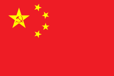 | 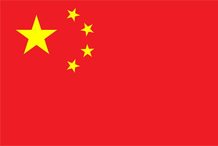  |  

国旗图案标准版本颜色  

| 格式 | 红色 | 黄色 |
| --- | --- | --- |
| RGB | 238/28/37 | 255/255/0 |
| HEX | #ee1c25ff | #ffff00ff |
| CMYK | 0/88/84/7 | 0/0/100/0 |

[下载一个标准的五星红旗](http://www.gov.cn/guoqing/20201231/guoqi.zip) (来源：[中国政府网](http://www.gov.cn/guoqing/guoqi/index.htm))

### 五星红旗的规格  

中国人民政治协商会议第一届全体会议主席团在1949年9月28日公布了国旗的制法。根据《中华人民共和国国旗法》第四条规定，制作国旗的企业由省、自治区和直辖市的人民政府指定。国旗的长宽之比为3:2。中华人民共和国国家质量监督检验检疫总局和中国国家标准化管理委员会颁布的《 [GB 12982-2004：国旗](http://www.gb688.cn/bzgk/gb/newGbInfo?hcno=EB0C64D782BFEE2F77AC6073074BD44E) 》标准中亦给出了国旗的制法说明

| 绘制方法 | 标准 |
| --- | --- |
| 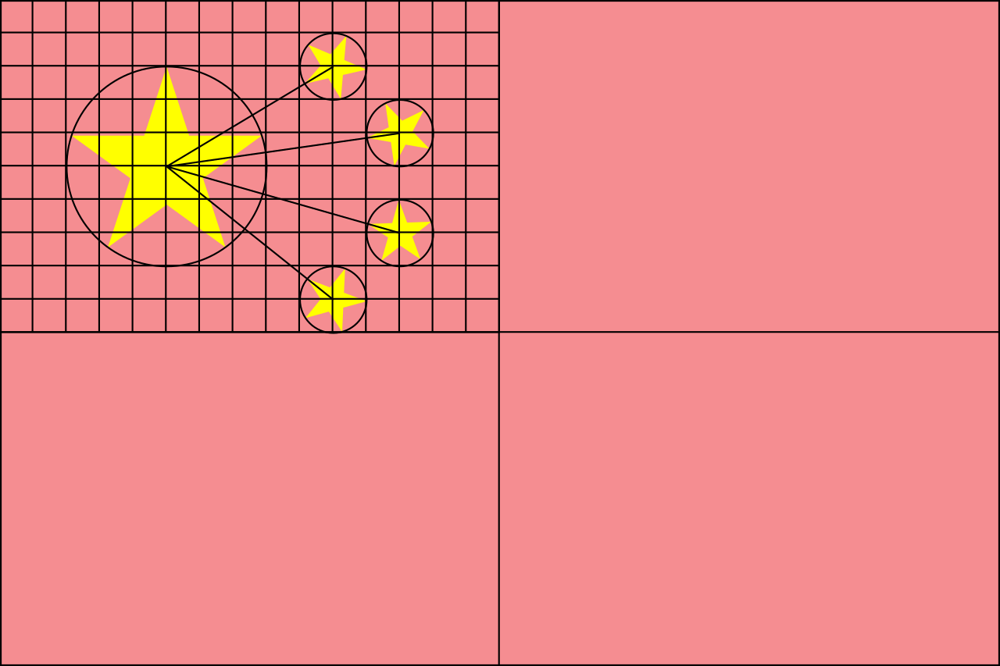 | 1. 先将旗面划分为4个等分长方形，再将左上方长方形划分长宽15×10个方格。  <br><br>2. 大五角星的中心位于该长方形上5下5、左5右10之处。大五角星外接圆的直径为6单位长度。  <br><br>3. 四颗小五角星的中心点，第一颗位于上2下8、左10右5，第二颗位于上4下6、左12右3，第三颗位于上7下3、左12右3，第四颗位于上9下1、左10右5之处。  <br><br>4. 每颗小五角星外接圆的直径均为2单位长度。四颗小五角星均有一角尖正对大五角星的中心点。  |

### 开始绘制  

从上面我们已经了解了国旗的相关由来，绘制标准，让我们愉快的开始五星红旗的绘制之旅吧，嘻嘻

#### 创建项目  

1. 第一步，打开我们的AndroidStudio，我这里使用的是 `Bumblebee 2021.1.1` 金丝雀版本。点击 `New Flutter Project` 按钮，创建一个新的flutter项目  

  

2. 第二步，选择项目类型，点击 `Next` 按钮进入项目信息设置页面，填写项目信息、项目类型（ `Application` ）、组织机构信息。作为新一代的程序员，这里我们勾上 `Kotlin` and `Swift` ，当前项目项目不涉及原生端的操作，所以我们把所有的平台都给勾上，嘻嘻。点击 `Finish` 按钮，完成项目的创建  

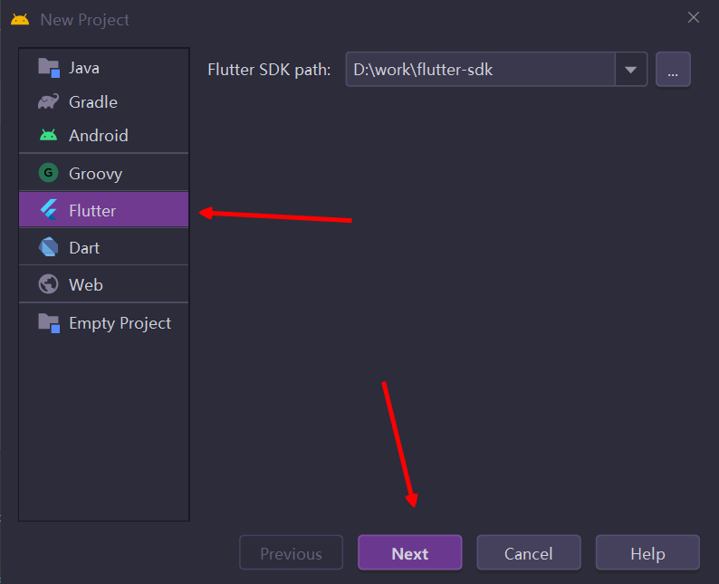  
  
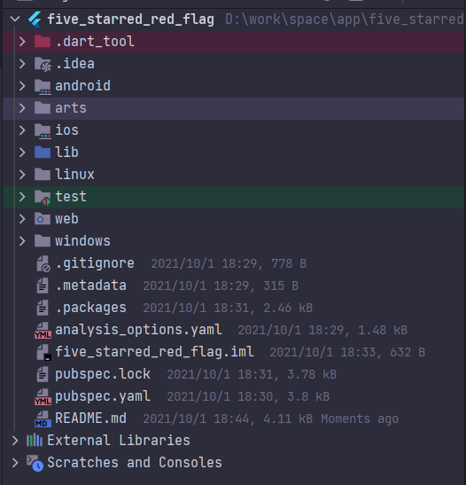  

#### 开始编码  

1. 首先，我们先删除项目中无用的代码，编写最基础的代码结构  

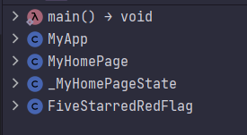  

3. 编写 `FiveStarredRedFlag` 类，继承 [CustomPainter](https://api.flutter-io.cn/flutter/rendering/CustomPainter-class.html) ，主要承载绘制的任务，这里我们复写 `paint` 和 `shouldRepaint` 方法，开始真正的绘制，Let's go，嘻嘻  

```dart
class FiveStarredRedFlag extends CustomPainter {

  @override
  void paint(Canvas canvas, Size size) {
  }
  @override
  bool shouldRepaint(covariant CustomPainter oldDelegate) {
    return false;
  }
}
```  

3. 根据国旗的绘制方法，我们先绘制一个辅助线图
- 绘制背景
```dart
    // 将整个国旗分为 30 * 20 的小格子，所以每个小格子的宽度为整个宽度除以30，得到每个格子的大小
    final double gridItemSize = size.width / (15 * 2);
    final Paint paint = Paint();
    // 设置抗锯齿
    paint.isAntiAlias = true;

    // 绘制背景
    paint
    ..style = PaintingStyle.fill
    ..color = const Color.fromARGB(255, 246, 138, 142);
    canvas.drawRect(Rect.fromLTWH(0, 0, size.width, size.height), paint);
```
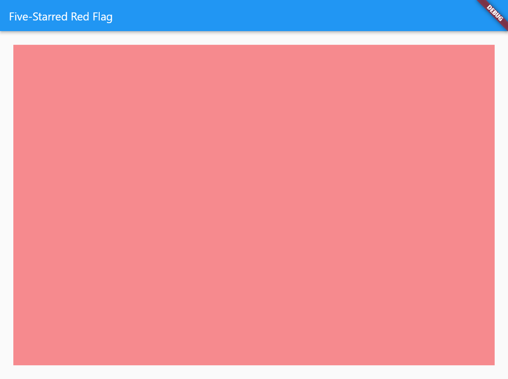  

- 绘制大格子
```dart
    /// 1. 先将旗面划分为4个等分长方形，再将左上方长方形划分长宽15×10个方格。
    paint
    ..style = PaintingStyle.stroke
    ..color = const Color.fromARGB(255, 8, 6, 6);
    // 绘制大格子
    canvas.drawRect(Rect.fromLTWH(0, 0, size.width, size.height), paint);
    // 绘制中分线，分为四个格子
    final double halfHeight = size.height / 2;
    canvas.drawLine(Offset(0, halfHeight), Offset(size.width, halfHeight), paint);
    final double halfWidth = size.width / 2;
    canvas.drawLine(Offset(halfWidth, 0), Offset(halfWidth, size.height), paint);
```
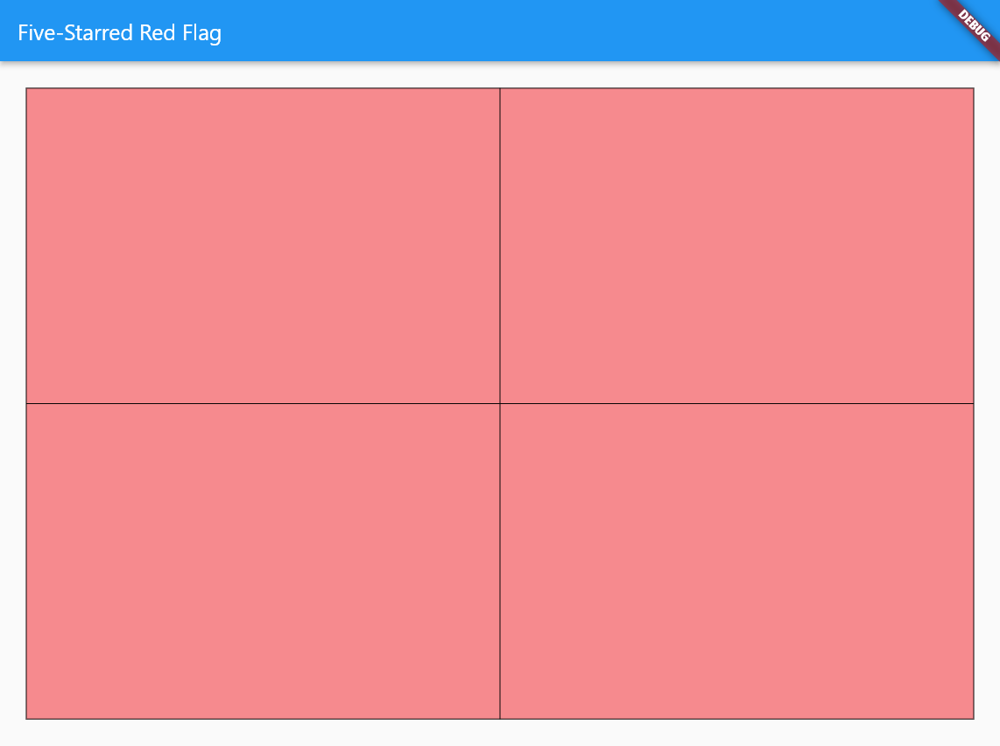  

- 绘制左上角小格子
```dart
    // 绘制横向线条
    for (int i = 1; i < 10; ++i) {
      canvas.drawLine(Offset(0, i * gridItemSize), Offset(halfWidth, i * gridItemSize), paint);
    }
    // 绘制竖向线条
    for (int i = 1; i < 15; ++i) {
      canvas.drawLine(Offset(i * gridItemSize, 0), Offset(i * gridItemSize, halfHeight), paint);
    }
```
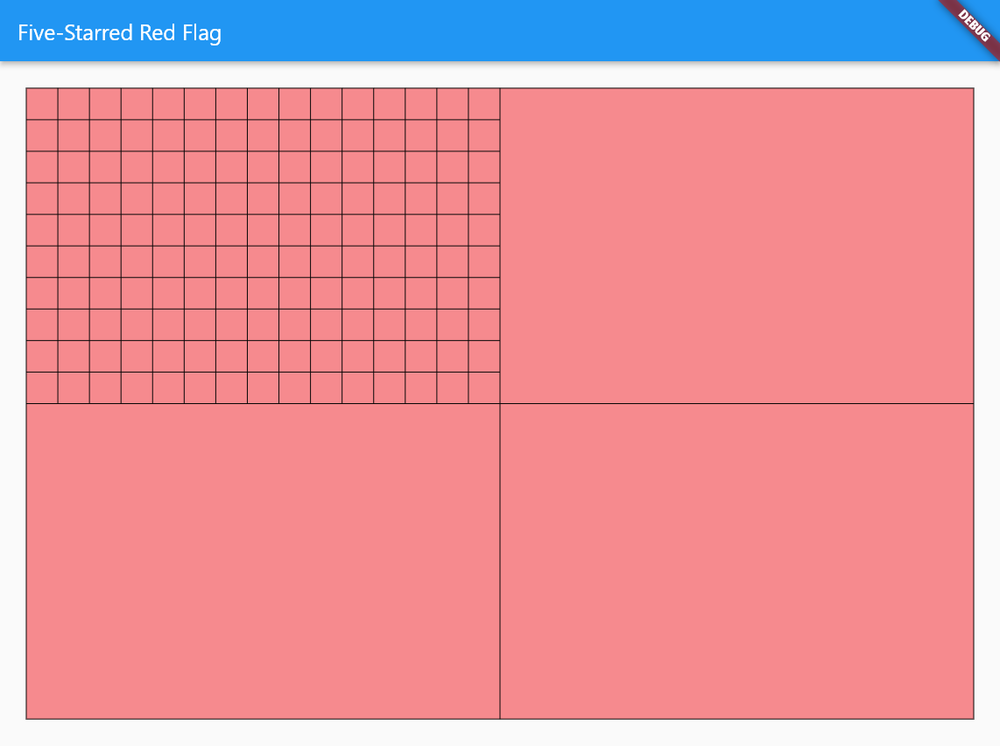  

- 绘制五角星所在位置的大圆与四个小圆
```dart
  /// 2. 大五角星的中心位于该长方形上5下5、左5右10之处。大五角星外接圆的直径为6单位长度。
  canvas.drawCircle(Offset(5 * gridItemSize, 5 * gridItemSize),
  6 / 2 * gridItemSize, paint);
  
  /// 3. 四颗小五角星的中心点，第一颗位于上2下8、左10右5，第二颗位于上4下6、左12右3，第三颗位于上7下3、左12右3，第四颗位于上9下1、左10右5之处。
  canvas.drawCircle(Offset(10 * gridItemSize, 2 * gridItemSize), gridItemSize, paint);
  canvas.drawCircle(Offset(12 * gridItemSize, 4 * gridItemSize), gridItemSize, paint);
  canvas.drawCircle(Offset(12 * gridItemSize, 7 * gridItemSize), gridItemSize, paint);
  canvas.drawCircle(Offset(10 * gridItemSize, 9 * gridItemSize), gridItemSize, paint);
```
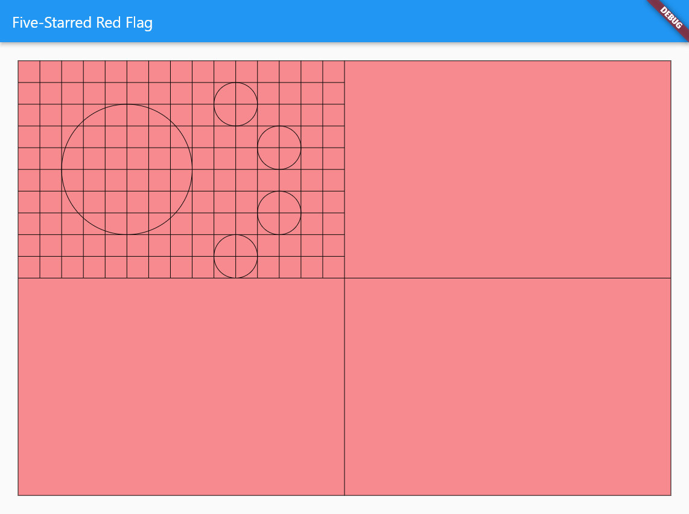  

- 绘制四个小圆圆心指向大圆圆心  

```dart
  // 将所有的小圆圆心与大圆圆心相连
  canvas.drawLine(Offset(5 * gridItemSize, 5 * gridItemSize), Offset(10 * gridItemSize, 2 * gridItemSize), paint);
  canvas.drawLine(Offset(5 * gridItemSize, 5 * gridItemSize), Offset(12 * gridItemSize, 4 * gridItemSize), paint);
  canvas.drawLine(Offset(5 * gridItemSize, 5 * gridItemSize), Offset(12 * gridItemSize, 7 * gridItemSize), paint);
  canvas.drawLine(Offset(5 * gridItemSize, 5 * gridItemSize), Offset(10 * gridItemSize, 9 * gridItemSize), paint);
```
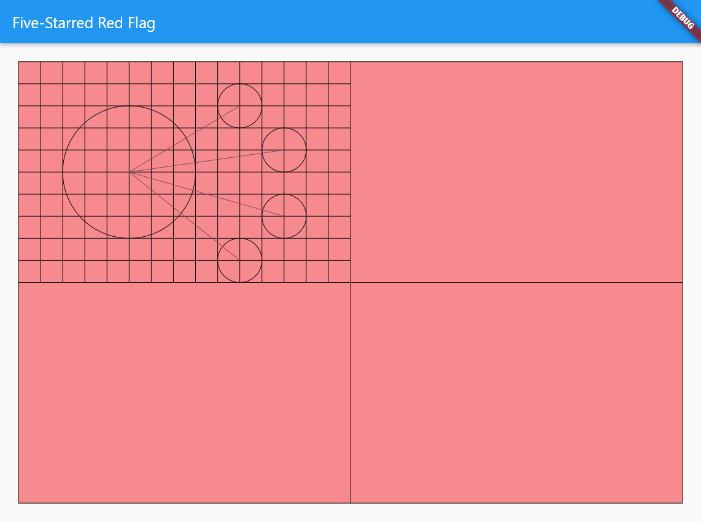  

到现在为止，我们已经把五星红旗的所有辅助线绘制完毕，下面开始进行重头戏，绘制五角星

4. 绘制五角星

- 如何定位五角星的五个点？  

我们知道，正五角星有五个内角，五个外角，在以五角星中心的坐标系中，我们用中心点和角顶点相连，可以得到均分的十份，每一份的角度为 `360° ÷ 10 = 36°` ，那么相邻的两个外角中间相差了 `36° × 2 = 72°` ，根据三角函数正余弦定理，现在我们可以轻易的得到每个点的坐标了。  

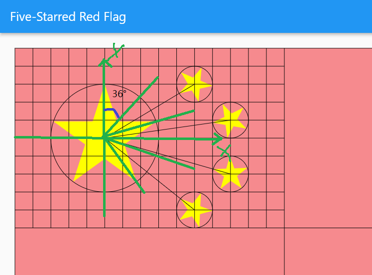

```dart
  void _drawStar(
    Canvas canvas,
    Paint paint,
    Offset center,
    double radius, {
    double offset = 0,
  }) {
    final Path path = Path();
    final List<Offset> points = [];
    // 获得五个顶点的坐标
    for (int i = 0; i < 5; i++) {
       // math.pi / 2 -> 90°
       // math.pi / 2.5 -> 72°
       // 每个点偏移的角度
       final double degree = math.pi / 2 + i * math.pi / 2.5 + offset;
       // 计算每个点的x，y坐标
       points.add(Offset(center.dx - (radius * math.cos(degree)),
               center.dy - (radius * math.sin(degree))));
    }
    // 将绘制点移到第一个点顶点
    path.moveTo(points[0].dx, points[0].dy);
    // 点与点之间的连接顺序为：0 -> 2 -> 4 -> 1 -> 3 -> 0
    path.lineTo(points[2].dx, points[2].dy);
    path.lineTo(points[4].dx, points[4].dy);
    path.lineTo(points[1].dx, points[1].dy);
    path.lineTo(points[3].dx, points[3].dy);
    path.lineTo(points[0].dx, points[0].dy);
    // 绘制路径
    canvas.drawPath(path, paint);
}
```  
- 绘制五角星
```dart
    // 绘制大五角星
    drawStar(canvas, paint, Offset(5 * gridItemSize, 5 * gridItemSize), 6 / 2 * gridItemSize);
    // 绘制小五角星
    drawStar(canvas, paint, Offset(10 * gridItemSize, 2 * gridItemSize), gridItemSize);
    drawStar(canvas, paint, Offset(12 * gridItemSize, 4 * gridItemSize), gridItemSize);
    drawStar(canvas, paint, Offset(12 * gridItemSize, 7 * gridItemSize), gridItemSize);
    drawStar(canvas, paint, Offset(10 * gridItemSize, 9 * gridItemSize), gridItemSize);
```

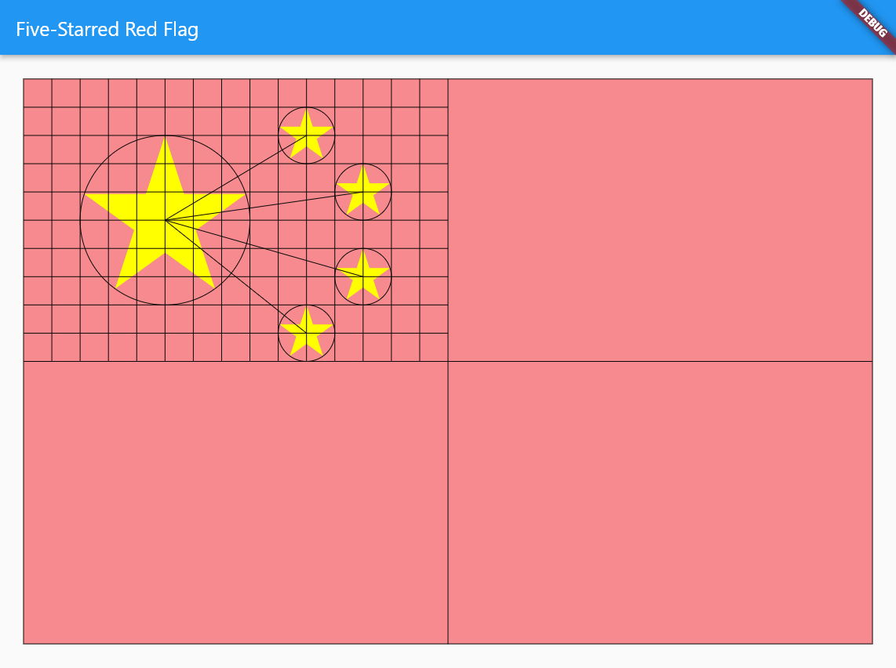

- 将四个小五角星的角指向大五角星的中心  

这里我们同样以大圆圆心做坐标轴原点画坐标轴，根据正弦定理获得小五角星偏移的角度，五角星实际旋转的角度为圆周减去偏移的角度，获得实际旋转的角度 `(360 - math.asin(5 / math.sqrt(math.pow(4, 2) + math.pow(5, 2))) * 180 / math.pi) * math.pi / 180` ，同理，我们可以获得另外三个小五角星的旋转角度

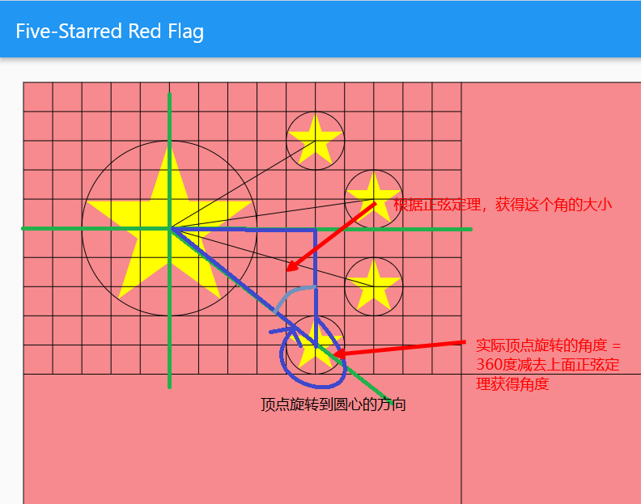

```dart
 // 绘制小五角星
    drawStar(
      canvas,
      paint,
      Offset(10 * gridItemSize, 2 * gridItemSize),
      gridItemSize,
      rotate: (270 -
              math.asin(3 / math.sqrt(math.pow(3, 2) + math.pow(5, 2))) *
                  180 /
                  math.pi) *
          math.pi /
          180,
    );
    drawStar(
      canvas,
      paint,
      Offset(12 * gridItemSize, 4 * gridItemSize),
      gridItemSize,
      rotate: (270 -
              math.asin(1 / math.sqrt(math.pow(7, 2) + math.pow(1, 2))) *
                  180 /
                  math.pi) *
          math.pi /
          180,
    );
    drawStar(
      canvas,
      paint,
      Offset(12 * gridItemSize, 7 * gridItemSize),
      gridItemSize,
      rotate: (360 -
              math.asin(7 / math.sqrt(math.pow(7, 2) + math.pow(2, 2))) *
                  180 /
                  math.pi) *
          math.pi /
          180,
    );
    drawStar(
      canvas,
      paint,
      Offset(10 * gridItemSize, 9 * gridItemSize),
      gridItemSize,
      rotate: (360 -
              math.asin(5 / math.sqrt(math.pow(4, 2) + math.pow(5, 2))) *
                  180 /
                  math.pi) *
          math.pi /
          180,
    );
```  

  

大功告成，最后再看一遍最终效果  

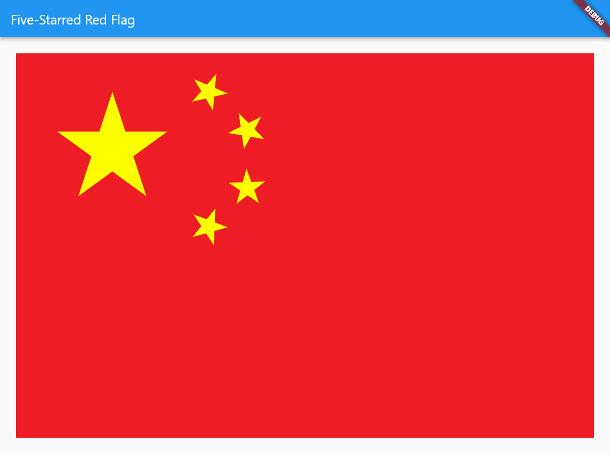

### 总结

- 这次五星红旗的绘制难点主要在于五角星和小五角星一个角指向大五角星中心，这里主要运用了 `正余弦定理` 相关的知识，算出五角星相关的信息，然后进行绘制
- 在绘制中我们主要用到了 [CustomPaint](https://api.flutter-io.cn/flutter/widgets/CustomPaint-class.html) 这个组件，实际的绘制在 [CustomPainter](https://api.flutter-io.cn/flutter/rendering/CustomPainter-class.html) 中进行，使用到了 [Canvas](https://api.flutter-io.cn/flutter/dart-ui/Canvas-class.html) 、 [Paint](https://api.flutter-io.cn/flutter/dart-ui/Paint-class.html) 、[Path](https://api.flutter-io.cn/flutter/dart-ui/Path-class.html) 相关的API，这些都是我们自定义绘制常用的API，建议多多了解，嘻嘻
- 最终的效果中，我们新增了一个hover变量，在 `shouldRepaint` 方法中，我们添加了 `covariant` 协变关键字，将参数由 `CustomPainter` 更改为 `FiveStarredRedFlag`  

```dart
  @override
  bool shouldRepaint(covariant FiveStarredRedFlag oldDelegate) {
    return oldDelegate.hover != hover;
  }
```

### 最后

祝祖国山河无恙，万世太平！！！各位十一快乐哦，嘻嘻

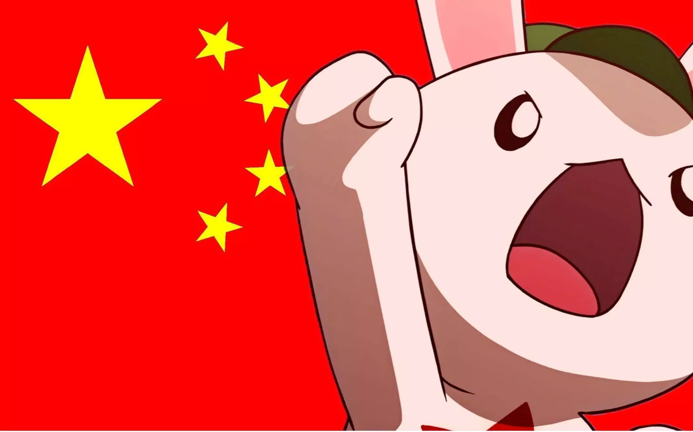

### 参考资料  

1. [维基百科 - 中华人民共和国国旗](https://zh.wikipedia.org/wiki/%E4%B8%AD%E5%8D%8E%E4%BA%BA%E6%B0%91%E5%85%B1%E5%92%8C%E5%9B%BD%E5%9B%BD%E6%97%97)
2. [国标](http://www.gb688.cn/bzgk/gb/newGbInfo?hcno=EB0C64D782BFEE2F77AC6073074BD44E)


